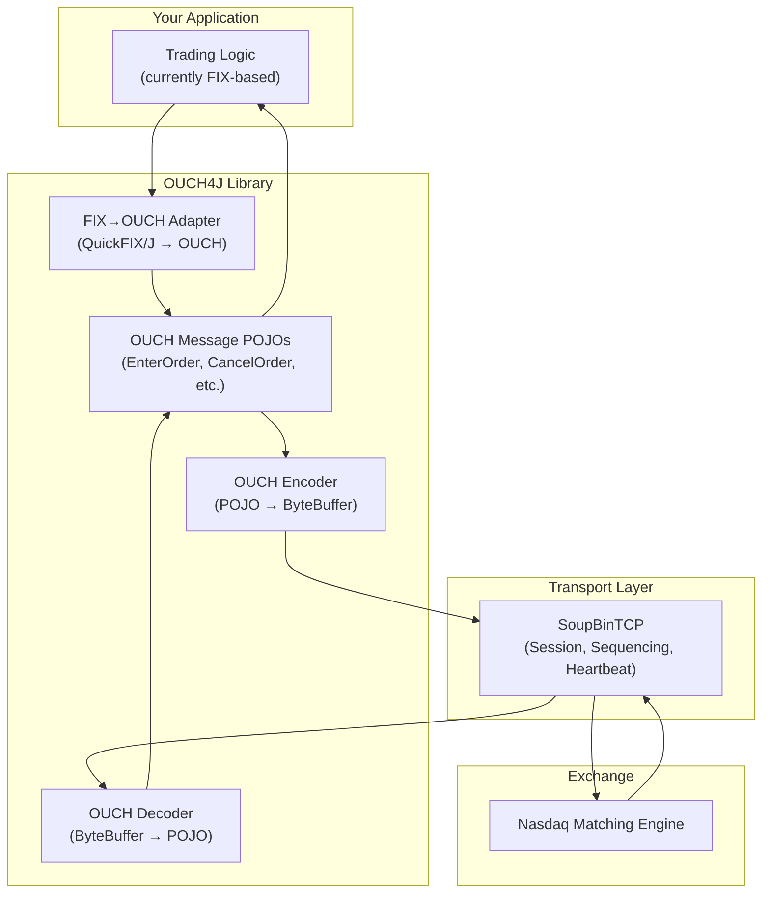
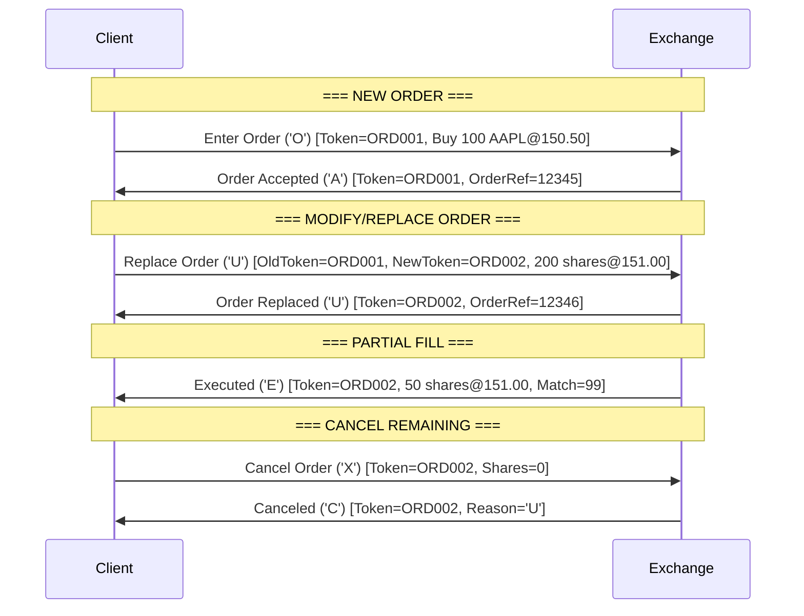

# OUCH4J 1.0 

Maven Central 

```xml
<dependency>
    <groupId>io.github.thilinajayamini</groupId>
    <artifactId>ouch4j</artifactId>
    <version>1.0.0</version>
</dependency>

```


## 1. What is OUCH?

OUCH is a **proprietary, binary order-entry protocol** developed by Nasdaq. It is designed for **ultra-low-latency** communication between trading participants and the exchange's matching engine. Unlike FIX, which is a universal, text-based industry standard, OUCH is purpose-built for speed — stripping away all the flexibility of FIX in favor of raw performance.

> [!NOTE]
> OUCH is used primarily by **high-frequency trading (HFT) firms** and **market makers** who need the fastest possible path to the exchange. Standard institutional clients typically use FIX, which the exchange gateway then translates into OUCH internally.

---

## 2. OUCH vs FIX — Key Differences

| Feature | FIX Protocol | OUCH 5.0 Protocol |
|:---|:---|:---|
| **Encoding** | Text (ASCII tag=value pairs, e.g. `35=D\|49=SENDER\|...`) | Binary (fixed-position bytes, big-endian integers) |
| **Latency** | Higher (text parsing overhead) | Ultra-low (direct memory read) |
| **Human Readable?** | ✅ Yes | ❌ No (requires specialized tools) |
| **Complexity** | Very high (hundreds of message types, thousands of tags) | Very low (< 10 message types) |
| **Scope** | All asset classes, workflows, allocations, etc. | Order entry only (Enter, Replace, Cancel, Executions) |
| **Universality** | Industry-wide standard | Proprietary to Nasdaq-family exchanges |
| **Session Layer** | Built-in (Logon, Heartbeat, Sequence Reset, etc.) | Delegated to **SoupBinTCP** transport |
| **Message Length** | Variable (text) | Variable (binary, with optional TagValue appendages) |
| **Sequencing** | Explicit (MsgSeqNum tag 34) | Outbound: Handled by SoupBinTCP. Inbound: Unsequenced, designed for safe retransmission |

### Example: Sending a Buy Order

**FIX (MsgType=D, NewOrderSingle):**
```
8=FIX.4.4|9=148|35=D|49=CLIENT1|56=NASDAQ|34=5|52=20260430-10:00:00|
11=ORD001|55=AAPL|54=1|38=100|40=2|44=150.50|59=0|10=123|
```

**OUCH 5.0 (Enter Order, Type='O'):**
```
Byte 0:    0x4F          ('O' = Enter Order)
Byte 1-4:  0x00000001    (UserRefNum = 1)
Byte 5-8:  0x00009650    (Price = 38480 → $150.50 × 256, or exchange-specific scaling)
Byte 9-12: 0x00000064    (Quantity = 100)
Byte 13:   0x42          ('B' = Buy)
... (more fields)
```

The binary message is **dramatically smaller** and requires **zero string parsing** — just read bytes at known offsets.

---

## 3. Protocol Architecture



---

## 4. Transport Layer: SoupBinTCP

OUCH doesn't handle its own session management. Instead, it rides on top of **SoupBinTCP**, which provides:

| Function | How it Works |
|:---|:---|
| **Login** | Client opens a TCP socket and sends a **Login Request** with credentials. Server replies with **Login Accepted** (or Rejected). |
| **Heartbeat** | Both sides must send a heartbeat if no data sent for **>1 second**. If no packet received for **~15 seconds**, the connection is considered dead. |
| **Sequencing** | Server→Client messages are sequenced. On reconnection, the client provides the last received sequence number to resume without gaps. |
| **Recovery** | Client→Server messages are **unsequenced** and designed for **safe retransmission** — if the connection drops mid-send, just resend. |
| **Logout** | Client sends Logout Request, or Server sends End-of-Session. |

---

## 5. OUCH 5.0 Data Types

| Type | Description | Example |
|:---|:---|:---|
| **Integer** | Unsigned, **big-endian** (network byte order) | 4-byte int: `0x00000064` = 100 |
| **Alpha** | Left-justified, **right-padded with spaces** (ASCII) | 8-byte stock: `"AAPL    "` |
| **Price** | Integer with implied decimal (exchange-specific scaling, often ×10000) | `1505000` = $150.50 |
| **Timestamp** | Nanoseconds since midnight (8-byte unsigned integer) | |

---

## 6. Message Types — Complete Reference

### 6.1 Inbound Messages (Client → Exchange)

#### `'O'` — Enter Order
Creates a new order on the exchange.

| Field | Length | Type | Description |
|:---|:---|:---|:---|
| Message Type | 1 | Alpha | `'O'` |
| Order Token | 14 | Alpha | Unique identifier for this order |
| Buy/Sell Indicator | 1 | Alpha | `'B'` = Buy, `'S'` = Sell, `'T'` = Sell Short, `'E'` = Sell Short Exempt |
| Shares | 4 | Integer | Number of shares |
| Stock | 8 | Alpha | Ticker symbol (space-padded) |
| Price | 4 | Integer | Limit price (scaled) |
| Time in Force | 4 | Integer | `0`=Market Hours, `99999`=IOC, etc. |
| Display | 1 | Alpha | `'Y'`=Displayed, `'N'`=Non-displayed, etc. |
| Capacity | 1 | Alpha | `'A'`=Agency, `'P'`=Principal, `'R'`=Riskless |
| Intermarket Sweep | 1 | Alpha | `'Y'`=ISO eligible, `'N'`=Not eligible |
| Minimum Quantity | 4 | Integer | Minimum execution quantity |
| Cross Type | 1 | Alpha | Cross type indicator |
| Customer Type | 1 | Alpha | Customer type indicator |
| *Appendage* | variable | TagValue | Optional extended fields (see §7) |

**FIX equivalent:** `NewOrderSingle` (MsgType=D)

---

#### `'U'` — Replace Order
**Yes, OUCH absolutely supports order modification!** This is the Replace Order message — it is the OUCH equivalent of FIX's `OrderCancelReplaceRequest` (MsgType=G).

> [!IMPORTANT]
> In OUCH, there is no separate "Modify/Amend" message. The **Replace** message serves as the change/modify mechanism. It atomically cancels the old order and creates a new one with the updated parameters (price, quantity, etc.), maintaining queue priority rules as defined by the exchange.

| Field | Length | Type | Description |
|:---|:---|:---|:---|
| Message Type | 1 | Alpha | `'U'` |
| Existing Order Token | 14 | Alpha | Token of the order to replace |
| Replacement Order Token | 14 | Alpha | New token for the replacement |
| Shares | 4 | Integer | New quantity |
| Price | 4 | Integer | New price |
| Time in Force | 4 | Integer | New TIF |
| Display | 1 | Alpha | New display instruction |
| Intermarket Sweep | 1 | Alpha | New ISE flag |
| Minimum Quantity | 4 | Integer | New minimum quantity |
| *Appendage* | variable | TagValue | Optional extended fields |

**FIX equivalent:** `OrderCancelReplaceRequest` (MsgType=G)

---

#### `'X'` — Cancel Order
Cancels a live order or reduces its quantity.

| Field | Length | Type | Description |
|:---|:---|:---|:---|
| Message Type | 1 | Alpha | `'X'` |
| Order Token | 14 | Alpha | Token of the order to cancel |
| Shares | 4 | Integer | New total quantity (`0` = cancel entirely) |

**FIX equivalent:** `OrderCancelRequest` (MsgType=F)

---

#### `'M'` — Account Query *(OUCH 5.0 specific)*
Queries account information.

---

### 6.2 Outbound Messages (Exchange → Client)

#### `'S'` — System Event
Signals system-wide events.

| Field | Length | Type | Description |
|:---|:---|:---|:---|
| Message Type | 1 | Alpha | `'S'` |
| Timestamp | 8 | Integer | Nanoseconds since midnight |
| Event Code | 1 | Alpha | `'S'`=Start of Day, `'E'`=End of Day |

---

#### `'A'` — Order Accepted
Confirms that an Enter Order was accepted. Echoes back order details (some may be modified by the exchange).

| Field | Length | Type | Description |
|:---|:---|:---|:---|
| Message Type | 1 | Alpha | `'A'` |
| Timestamp | 8 | Integer | Nanoseconds since midnight |
| Order Token | 14 | Alpha | Your order token |
| Buy/Sell Indicator | 1 | Alpha | As submitted |
| Shares | 4 | Integer | As submitted |
| Stock | 8 | Alpha | As submitted |
| Price | 4 | Integer | Possibly adjusted by exchange |
| Time in Force | 4 | Integer | As submitted |
| Order Reference Number | 8 | Integer | Exchange-assigned unique order ID |
| ... | | | Additional echoed fields |

**FIX equivalent:** `ExecutionReport` (MsgType=8) with `ExecType=0` (New)

---

#### `'U'` — Order Replaced
Confirms that a Replace Order was processed.

**FIX equivalent:** `ExecutionReport` (MsgType=8) with `ExecType=5` (Replaced)

---

#### `'E'` — Order Executed
Notifies that part or all of an order has been filled.

| Field | Length | Type | Description |
|:---|:---|:---|:---|
| Message Type | 1 | Alpha | `'E'` |
| Timestamp | 8 | Integer | Nanoseconds since midnight |
| Order Token | 14 | Alpha | Your order token |
| Executed Shares | 4 | Integer | Number of shares executed |
| Execution Price | 4 | Integer | Price at which execution occurred |
| Liquidity Flag | 1 | Alpha | `'A'`=Added, `'R'`=Removed |
| Match Number | 8 | Integer | Exchange-assigned match ID |

**FIX equivalent:** `ExecutionReport` (MsgType=8) with `ExecType=F` (Trade)

---

#### `'C'` — Order Canceled
Notifies that an order has been canceled (by user request or system).

| Field | Length | Type | Description |
|:---|:---|:---|:---|
| Message Type | 1 | Alpha | `'C'` |
| Timestamp | 8 | Integer | Nanoseconds since midnight |
| Order Token | 14 | Alpha | Your order token |
| Decrement Shares | 4 | Integer | Shares removed |
| Reason | 1 | Alpha | `'U'`=User requested, `'T'`=Timeout, `'S'`=System, etc. |

**FIX equivalent:** `ExecutionReport` (MsgType=8) with `ExecType=4` (Canceled)

---

#### `'J'` — Order Rejected
Notifies that an Enter or Replace order was rejected.

| Field | Length | Type | Description |
|:---|:---|:---|:---|
| Message Type | 1 | Alpha | `'J'` |
| Timestamp | 8 | Integer | Nanoseconds since midnight |
| Order Token | 14 | Alpha | Your order token |
| Reason | 2 | Integer | Reject reason code |

**FIX equivalent:** `ExecutionReport` (MsgType=8) with `ExecType=8` (Rejected) or `BusinessMessageReject` (MsgType=j)

---

## 7. TagValue Appendages (OUCH 5.0 Extension Mechanism)

OUCH 5.0 introduced **variable-length appendages** at the end of messages. This is how new fields are added without breaking backward compatibility.

```
┌──────────────────────┬──────────────────────────────┐
│  Fixed Fields         │  TagValue Appendages         │
│  (always present)     │  (optional, variable)        │
└──────────────────────┴──────────────────────────────┘
```

Each appendage tag has:
| Component | Length | Description |
|:---|:---|:---|
| Tag ID | 2 | Unsigned integer identifying the field |
| Length | 2 | Length of the value in bytes |
| Value | variable | The field value |

This means your **decoder must be forward-compatible** — if it encounters an unknown tag, it should skip over it using the length field.

---

## 8. FIX → OUCH Field Mapping Summary

This is the mapping our adapter will implement:

| FIX Field | FIX Tag | OUCH Field | Notes |
|:---|:---|:---|:---|
| MsgType | 35 | Message Type | `D`→`O`, `G`→`U`, `F`→`X` |
| ClOrdID | 11 | Order Token | 14-char alpha, space-padded |
| Side | 54 | Buy/Sell Indicator | `1`→`B`, `2`→`S`, `5`→`T` |
| OrderQty | 38 | Shares | Direct integer mapping |
| Symbol | 55 | Stock | 8-char alpha, space-padded |
| Price | 44 | Price | Must apply exchange scaling factor |
| TimeInForce | 59 | Time in Force | `0`(Day)→`0`, `3`(IOC)→`99999`, etc. |
| ExecInst | 18 | Display | Map to display flags |
| OrderCapacity | 528 | Capacity | `A`→`A`, `P`→`P` |
| OrigClOrdID | 41 | Existing Order Token | Used in Replace/Cancel |

---

## 9. Order Lifecycle Comparison



---

